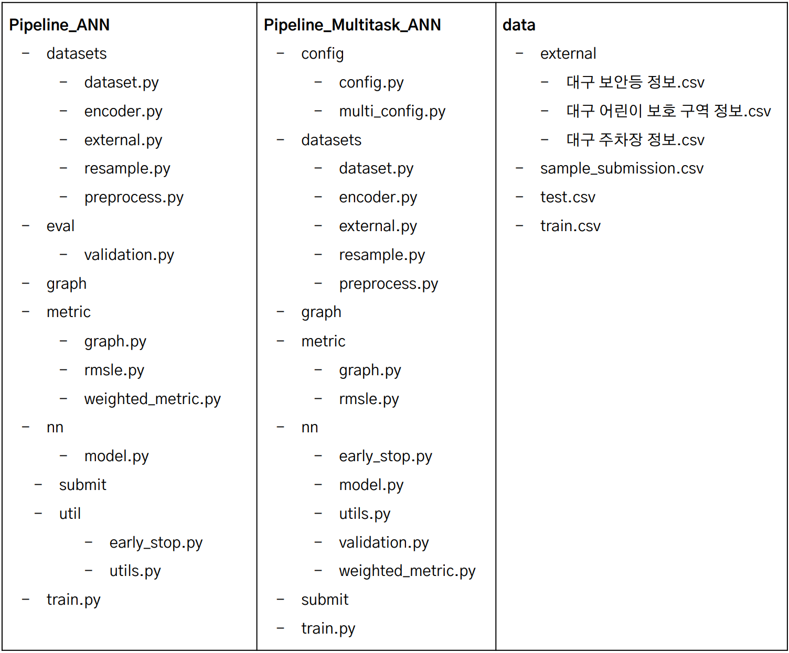

# est_wassup_01
ESTSoft Wassup 1기 첫번째 프로젝트

팀 Popcorn [김범찬, 김종성, 박지연, 송승민, 이유성]

# <line>
**Data Source** <br/>
대구시 교통사고 예측 경진대회 [Dacon](https://dacon.io/competitions/official/236193/data)

# <line>
**Target** <br/>
ECLO(Equivalent Casualty Loss Only, 인명피해 심각도) <br/>
= 사망자수x10 + 중상자수x5 + 경상자수x3 + 부상자수x1 <br/>
사망자수, 중상자수, 경상자수, 부상자수를 각각 예측하는 multi-task learning model 설계

# <line>
**Terminal** <br/>
Pipeline_Multitask_ANN폴더 이동 후 <br/>
```python train.py``` <br/>
기본적으로 config폴더의 config.py이 실행되도록 설정되어있음 <br/>
각종 경로와 hyper-prameter 등 설정 가능 <br/>

```python train.py -mode True```</br>
multi mode를 작동시키는 명령어(multi_config.py 파일들을 실행) <br/>
여러 config file을 만들어 놓고, 순차적으로 작동하도록 사용 가능 <br/>

# <line>
**Preprocess Summary** <br/>
Select Numeric Data <br/>
Label Encoding <br/>
Merge External Data <br/>

# <line>
**Metrics** <br/>
RMSE <br/>
R2 SCORE <br/>

# <line>
**Pipelines** <br/>
Directory <br/>


# <line>
**Final Model** <br/>
graph_final.png <br/>
model_final.pth <br/>
submission_final.pth <br/>
[Final PPT Link](https://docs.google.com/presentation/d/17s3GWBoFbudTkhIefxajmLOW2N22vPXUSj5Uligo64w/edit?usp=sharing)

# <line> 
**Conda Environment List** <br/>
requirements.yaml
